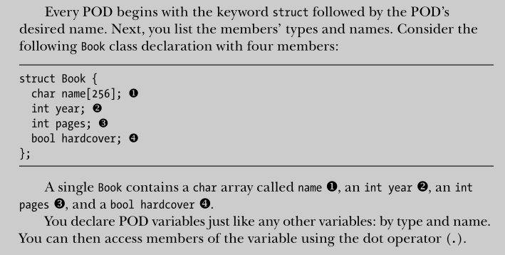

# Fundamental Types: 

## Format specifiers:


## Integer:


### Signed and unsigned:
In laymen's terms an unsigned int is an integer that can not be negative and thus has a higher range of positive values that it can assume. A signed int is an integer that can be negative but has a lower positive range in exchange for more negative values it can assume.

## Floating Point Numbers:


## Charater types:


## Boolean:


### size_t type:


## void:
none

# Array:


# User-Defined Types:
## Enumerations:
The simplest of the user-defined types.
The values that an enumeration can take are restricted to a set of possible values.
Enumerations are excellent for modeling categorical concepts.

Under the hood, these values are simply integers, but they allow you towrite safer, more expressive code by using programmer-defined types rather than integers that could mean anything.

Eg:
```c++
enum class Race {
 Dinan,
 Teklan,
 Ivyn,
 Moiran,
 Camite,
 Julian,
 Aidan
};
```
Inialize using 
```
Race langobard_race = Race::Aidan;
```


## Classses (POD) (Plain-Old-Data Classes):
Classes are user-defined types that contain data and functions, and they’re the heart and soul of C++. The simplest kind of classes are plain-old-data classes (PODs). PODs are simple containers.
Think of them as a sort of heterogeneous array of elements of potentially different types. Each element of a class is called a member.


## Unions:
Dont use them.

## 