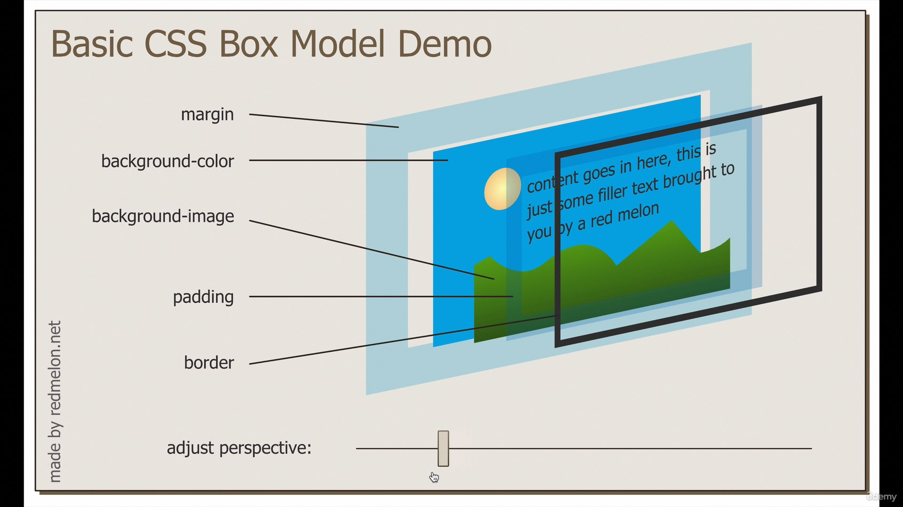

# css

- css treats everything like a box. Manipulate that box, to change the properties.
- elements have default value, make sure to specify

Will be inside `<head></head>`

`<link rel="stylesheet" href="css/style.css">`

- Use favicon like this:
`<link rel='icon' href='link/to/favicon.ico'>`

# Common properties-
- border...., margin...., paddin....
- width, height
- text-align
- color, background-color
- display (block, inline, etc)
- font....
- letter-spacing, word-spacing, line-height
- z-index

# to write
margin,. border padding, widthandheight

disaplay property:

h1-6 p od ul li div form : block i.e., take whole width. width has effect

span images anchor : inline i.e., take jsut whats needed. width doesnt have effect
allow us to have multiple boxed in a single line since they dont cover the whoel width
can treat images as inline-block

inline-block : inline with width i.e., best of both word

none : just deletes the box i.e., wiped out of existence

position:

static: default shit
relative: relative where it was supposerd to be
absolute: is relative to the parent element
fixed: fixed position in the screen (make dancy site with permanent topbar)

cneter something inside a div?

text-align: center;
set it inside parent element
center everything inside element
wont work if child ele have a width or display block

or

margin: 0 auto 0 auto;
use auto if width set
auto will center it. 0 is just for fromn where not to center.
very dynamic

for fonts use 
https://fonts.google.com/
awesome shit

1em = 100% = 16px
size is inheritary i.e., if h1 is in body and body has font-size 2em and h1 has font-size 4em, h1 gets scaled higher because the parent element also has a specified font size.
to avoid this use 'rem' maens root em. it doesnt inherit from parent.
